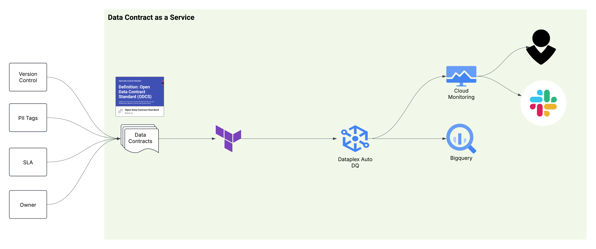

# Data Contract with GCP Dataplex


## Understanding Data Contracts

A **data contract** is a formal agreement between data producers and consumers, specifying the structure, quality, and governance requirements for data exchanged between systems or teams. Data contracts provide:

- Clear definitions and versioning of data schemas and formats.
- Enforcement of data quality rules and validation standards.
- Documentation of ownership, access controls, and security policies.
- Change management processes to minimise the risk of breaking downstream dependencies.

By leveraging GCP Dataplex, data contracts enable automated enforcement of data quality and governance policies, managed via Terraform infrastructure as code.

This approach is inspired by the [Data Contract Specification](https://datacontract.com/#field-object) and the [Open Data Contract Standard](https://bitol-io.github.io/open-data-contract-standard/v3.0.2/#definitions_4), and can be adapted to meet your specific requirements.
### When to Implement a Data Contract

Data contracts are important for ensuring alignment between data producers and consumers through a structured, version-controlled agreement—much like SLAs for APIs. While they do not replace direct communication, data contracts provide a persistent reference that evolves with your data landscape.

In environments using multiple tools for data ingestion (e.g., Fivetran), transformation (e.g., dbt, Dataform), and observability (e.g., Monte Carlo), data contracts clarify expectations around data quality, cataloguing, and governance—even when there is no single source of truth. To encourage adoption, you may need to implement custom automation or integrations to streamline workflows across these platforms.

Further data governance capabilities that can be integrated into your data contract for a more automated and technical approach include:

- Manual PII tagging in BigQuery to enhance data privacy.
- Integration with external tools using custom format converters.
- Dataplex data profiling for ongoing data quality assessment.
- Schema drift detection and alerting to maintain data integrity.

These features go beyond the current repository and can be adapted to suit your organisation’s specific governance needs.





## Step-by-Step

1. *(Optional)* **Create Sample Data in BigQuery:**
    - Run SQL statements to create the `transactions` table and insert sample records for testing purposes.

2. **Configure Remote Backend and Providers:**
    - Edit `backend.tf` to configure a remote backend (e.g., a GCS bucket) for secure Terraform state management with state locking and encryption enabled.
    - In `providers.tf`, specify and lock the required provider versions to ensure consistent deployments across environments.

3. **Update Configuration Files:**
    - Edit `data_contract.yaml` to set your GCP project and BigQuery dataset values.
    - Update the `gcp_dataplex_rules.yaml` file to define Dataplex data quality rules and trigger specifications according to your requirements.

4. **Initialize and Deploy Infrastructure:**
    ```sh
    terraform init
    terraform validate
    terraform plan
    terraform apply
    ```

## Useful Links

- [Define Dataplex data quality rules](https://cloud.google.com/dataplex/docs/use-auto-data-quality#sample-rules)
- [Manage Dataplex as code](https://cloud.google.com/dataplex/docs/manage-data-quality-rules-as-code)
- [Automated data profiling and quality scan via Dataplex](https://www.youtube.com/watch?v=QqxLUu1GIJA)

**Current limitations with Dataplex (as of writing):**

- The Dataplex Terraform resource does not support sharing with the BigQuery UI ([issue link](https://issuetracker.google.com/issues/304996498?pli=1)).
- Alerts and notifications must be built using alert policy and notification channel resources; alerts do not propagate through data lineage.
- Deleting a Dataplex quality scan results in loss of history unless export is enabled.

---
